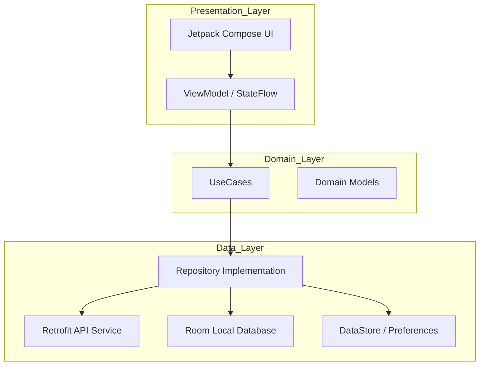

# SDMS Android - Smart Dormitory Management System

[](https://developer.android.com)
[](https://kotlinlang.org)
[](https://developer.android.com/jetpack/compose)

SDMS (Smart Dormitory Management System) is a modern Android application designed to streamline dormitory operations for both students and administrators. It leverages AI-powered face recognition for secure access and provides a comprehensive suite of digital services for dormitory life.

## Overview

Dormitory management often involves fragmented processes for registration, payment, and security. SDMS addresses these challenges by providing a unified mobile platform that:
*   Enhances security through AI biometric verification.
*   Automates utility billing and online payments.
*   Simplifies administrative approvals for room transfers and stay extensions.
*   Provides real-time notifications and incident reporting.

## Features

### Student Features
*   **Authentication & Security:** Secure login with JWT, biometric unlock, and encrypted session management.
*   **AI Face Recognition:** Registration and verification using on-device ML Kit and TensorFlow Lite.
*   **Smart Access:** QR-based check-in and access history tracking.
*   **Room Management:** View room details, roommates, and submit room transfer requests.
*   **Payments:** View unpaid invoices (Electricity, Water, Rent) and instructions for online payment.
*   **Stay Extension:** Check eligibility and submit requests for the next academic period.
*   **Service Requests:** Submit maintenance requests with photo attachments.
*   **Notifications:** Receive official announcements and violation alerts.

### Admin Features
*   **Dashboard:** Real-time statistics on dormitory occupancy and pending requests.
*   **Access Control:** Monitor student access logs and perform manual QR check-ins.
*   **Approval Workflow:** Review and approve stay extensions, room transfers, and face registration updates.
*   **Broadcasts:** Send system-wide notifications to all students.

## Architecture

The project follows **Clean Architecture** principles combined with the **MVVM (Model-View-ViewModel)** pattern to ensure scalability, testability, and maintainability.



## Technology Stack

| Category | Technology |
| :--- | :--- |
| **Language** | Kotlin (JVM 11) |
| **UI Framework** | Jetpack Compose |
| **Architecture** | MVVM + Clean Architecture |
| **Dependency Injection** | Hilt (Dagger) |
| **Networking** | Retrofit 2 + OkHttp 4 |
| **Database** | Room + SQLCipher (Encrypted) |
| **AI / Machine Learning** | ML Kit (Face Detection) + TensorFlow Lite |
| **Asynchronous** | Kotlin Coroutines + Flow |
| **Image Loading** | Coil |
| **Build System** | Gradle 8.7 (Kotlin DSL) |

## System Requirements

### Minimum Requirements
*   **Android SDK:** API Level 24 (Android 7.0)
*   **JDK:** version 11
*   **RAM:** 8GB (for building)
*   **Storage:** 2GB free space

### Recommended Environment
*   **Android Studio:** Ladybug (2024.2.1) or newer
*   **Android SDK:** API Level 35
*   **Device:** Physical Android device with Biometric support and Camera

## Installation

### 1. Clone the repository
```bash
git clone https://github.com/Vkbp/SmartDormitory-Android.git
cd SmartDormitory-Android
```

### 2. Open in Android Studio
1. Launch Android Studio.
2. Select **File > Open** and navigate to the project directory.
3. Wait for Gradle synchronization to complete.

## Configuration

The application requires a valid backend API endpoint.

1.  Create a `local.properties` file in the root directory (if not already present).
2.  Add your API Base URL:
    ```properties
    BASE_URL=http://your-api-endpoint:8080/api/
    ```
    *Note: Use `10.0.2.2` if connecting to a backend running on your local machine from an emulator.*

## Build & Run

### Build APK
To generate a debug APK:
```powershell
.\gradlew.bat assembleDebug
```
The APK will be located at `app/build/outputs/apk/debug/app-debug.apk`.

### Run on Device
1.  Connect your physical device via USB or start an emulator.
2.  Click the **Run** icon in Android Studio or use:
    ```powershell
    .\gradlew.bat installDebug
    ```

## Usage Guide

### Student Workflow
1.  **Splash & Login:** Launch the app and sign in with student credentials.
2.  **Face Registration:** Navigate to the AI module to register your face for smart access.
3.  **Services:** Use the bottom navigation to access Room details, Payments, and Requests.
4.  **Stay Extension:** During registration periods, use the home screen shortcut to extend your stay.

### Admin Workflow
1.  **Switch Role:** Login with administrator credentials.
2.  **Check-in:** Use the QR scanner feature to verify student entry at the gate.
3.  **Review:** Open the Dashboard to see pending room transfers or face registration updates.

## Project Structure

```text
SDMS-Android/
├── app/
│   ├── src/
│   │   ├── main/
│   │   │   ├── java/com/ktx/dormitory/
│   │   │   │   ├── admin/      # Admin-specific features
│   │   │   │   ├── ai/         # Face recognition logic
│   │   │   │   ├── core/       # Shared base classes, utils, networking
│   │   │   │   ├── di/         # Hilt modules
│   │   │   │   ├── shared/     # Features shared by Student/Admin (Auth, Profile)
│   │   │   │   ├── student/    # Student-specific features
│   │   │   │   └── ui/         # Theme and global UI components
│   │   │   └── AndroidManifest.xml
│   │   └── test/               # Unit tests
│   └── build.gradle.kts
├── docs/                       # Official technical documentation
├── thesis/                     # Academic documentation and reports
├── build.gradle.kts
└── settings.gradle.kts
```

## Security
*   **JWT Handling:** Tokens are securely stored and automatically refreshed using OkHttp Interceptors.
*   **Database Encryption:** Local Room database is encrypted using **SQLCipher**.
*   **Integrity Check:** Basic root detection and package signature verification are implemented.
*   **Warning:** Never commit sensitive configuration or signing keys to the repository.

## Known Limitations
*   **Backend Dependency:** Most features require an active connection to the SDMS Backend API.
*   **Mock Data:** Some administrative statistics currently use placeholder data for demonstration.
*   **Test Coverage:** Core business logic is unit tested; UI testing is partially implemented.

## Academic Context
This software is developed as part of a University Graduation Thesis. It demonstrates the integration of modern Android development patterns with AI and IoT concepts for real-world dormitory management.

## License
This project is licensed under the MIT License - see the [LICENSE](LICENSE) file for details.
