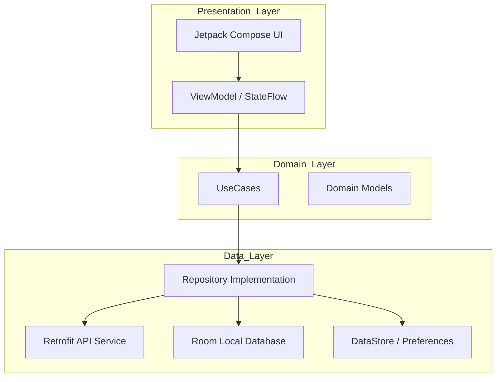

# SDMS Android - Hệ thống Quản lý Ký túc xá Thông minh

[](https://developer.android.com)
[](https://kotlinlang.org)
[](https://developer.android.com/jetpack/compose)

SDMS (Smart Dormitory Management System) là ứng dụng Android hiện đại được xây dựng nhằm số hóa và đơn giản hóa công tác quản lý ký túc xá dành cho sinh viên và ban quản lý.

Hệ thống ứng dụng công nghệ nhận diện khuôn mặt bằng AI nhằm tăng cường bảo mật, đồng thời cung cấp các dịch vụ số phục vụ hoạt động sinh hoạt và quản lý ký túc xá.

---

## Tổng quan

Công tác quản lý ký túc xá thường bao gồm nhiều quy trình riêng lẻ như đăng ký, thanh toán, quản lý phòng và kiểm soát an ninh.

SDMS giải quyết vấn đề này bằng cách cung cấp một nền tảng di động thống nhất, giúp:

- Tăng cường an ninh thông qua xác thực sinh trắc học bằng AI.
- Số hóa việc quản lý tiền điện, nước, tiền phòng và thanh toán trực tuyến.
- Đơn giản hóa quy trình xử lý và phê duyệt các yêu cầu của sinh viên.
- Cung cấp thông báo và thông tin sự cố theo thời gian thực.

---

## Các chức năng

### Chức năng dành cho Sinh viên

- **Xác thực & Bảo mật:** Đăng nhập an toàn bằng JWT, mở khóa bằng sinh trắc học và quản lý phiên đăng nhập được mã hóa.
- **Nhận diện khuôn mặt bằng AI:** Đăng ký và xác thực khuôn mặt bằng ML Kit và TensorFlow Lite.
- **Truy cập thông minh:** Hỗ trợ truy cập bằng QR và theo dõi lịch sử ra vào.
- **Quản lý phòng:** Xem thông tin phòng, danh sách bạn cùng phòng và gửi yêu cầu chuyển phòng.
- **Thanh toán:** Xem các khoản chưa thanh toán như điện, nước, tiền phòng và hướng dẫn thanh toán trực tuyến.
- **Gia hạn thời gian ở:** Kiểm tra điều kiện và gửi yêu cầu gia hạn thời gian ở cho kỳ học tiếp theo.
- **Yêu cầu dịch vụ:** Gửi yêu cầu sửa chữa/bảo trì kèm hình ảnh.
- **Thông báo:** Nhận thông báo chính thức và cảnh báo vi phạm.

### Chức năng dành cho Quản trị viên

- **Dashboard:** Theo dõi các thống kê về tình trạng sử dụng ký túc xá và các yêu cầu đang chờ xử lý.
- **Kiểm soát truy cập:** Theo dõi lịch sử ra vào và thực hiện check-in thủ công cho sinh viên.
- **Quy trình phê duyệt:** Xem xét và xử lý các yêu cầu liên quan đến gia hạn thời gian ở, chuyển phòng và cập nhật đăng ký khuôn mặt.
- **Gửi thông báo:** Gửi thông báo đến sinh viên trong hệ thống.

---

## Kiến trúc

Dự án tuân theo các nguyên tắc của **Clean Architecture**, kết hợp với mô hình **MVVM (Model-View-ViewModel)** nhằm đảm bảo khả năng mở rộng, kiểm thử và bảo trì hệ thống.



---

## Công nghệ sử dụng

| Nhóm | Công nghệ |
| :--- | :--- |
| **Ngôn ngữ** | Kotlin (JVM 11) |
| **Giao diện** | Jetpack Compose |
| **Kiến trúc** | MVVM + Clean Architecture |
| **Dependency Injection** | Hilt (Dagger) |
| **Networking** | Retrofit 2 + OkHttp 4 |
| **Cơ sở dữ liệu** | Room + SQLCipher (Mã hóa) |
| **AI / Machine Learning** | ML Kit (Face Detection) + TensorFlow Lite |
| **Xử lý bất đồng bộ** | Kotlin Coroutines + Flow |
| **Tải hình ảnh** | Coil |
| **Hệ thống Build** | Gradle 8.7 (Kotlin DSL) |

---

## Yêu cầu hệ thống

### Yêu cầu tối thiểu

- **Android SDK:** API Level 24 (Android 7.0)
- **JDK:** Phiên bản 11
- **RAM:** 8GB trở lên đối với quá trình build
- **Dung lượng lưu trữ:** Tối thiểu 2GB trống

### Môi trường khuyến nghị

- **Android Studio:** Ladybug (2024.2.1) hoặc mới hơn
- **Android SDK:** API Level 35
- **Thiết bị:** Thiết bị Android thực tế có hỗ trợ sinh trắc học và Camera

---

## Cài đặt

### 1. Clone repository

```bash
git clone https://github.com/Vkbp/SmartDormitory-Android.git
cd SmartDormitory-Android
```

### 2. Mở dự án bằng Android Studio

1. Khởi động Android Studio.
2. Chọn **File > Open**.
3. Chọn thư mục dự án.
4. Chờ quá trình đồng bộ Gradle hoàn tất.

---

## Cấu hình

Ứng dụng yêu cầu một địa chỉ API Backend hợp lệ.

### Tạo `local.properties`

Tạo file `local.properties` tại thư mục gốc của dự án nếu file chưa tồn tại.

Thêm địa chỉ API:

```properties
BASE_URL=http://your-api-endpoint:8080/api/
```

> **Lưu ý:** Nếu Backend đang chạy trên máy tính và ứng dụng được chạy bằng Android Emulator, sử dụng `10.0.2.2` thay cho `localhost`.

Ví dụ:

```properties
BASE_URL=http://10.0.2.2:8080/api/
```

> Không commit các thông tin cấu hình hoặc secret nhạy cảm vào Git repository.

---

## Build & Chạy ứng dụng

### Build APK

Để tạo APK Debug:

```powershell
.\gradlew.bat assembleDebug
```

APK sau khi build thành công sẽ nằm tại:

```text
app/build/outputs/apk/debug/app-debug.apk
```

### Chạy trên thiết bị

1. Kết nối thiết bị Android thực tế thông qua USB hoặc khởi động Emulator.
2. Nhấn nút **Run** trong Android Studio.

Hoặc sử dụng:

```powershell
.\gradlew.bat installDebug
```

---

## Hướng dẫn sử dụng

### Quy trình Sinh viên

1. **Splash & Đăng nhập:** Khởi động ứng dụng và đăng nhập bằng tài khoản sinh viên.
2. **Đăng ký khuôn mặt:** Truy cập module AI để đăng ký khuôn mặt phục vụ việc truy cập thông minh.
3. **Dịch vụ:** Sử dụng thanh điều hướng để truy cập thông tin phòng, thanh toán và các yêu cầu dịch vụ.
4. **Gia hạn thời gian ở:** Trong thời gian đăng ký, sử dụng chức năng tương ứng trên màn hình chính để gửi yêu cầu gia hạn.

### Quy trình Quản trị viên

1. **Đăng nhập:** Đăng nhập bằng tài khoản quản trị viên.
2. **Check-in:** Sử dụng chức năng check-in để xác nhận sinh viên vào ký túc xá.
3. **Xử lý yêu cầu:** Truy cập Dashboard để xem và xử lý các yêu cầu đang chờ.

---

## Cấu trúc dự án

```text
SDMS-Android/
├── app/
│   ├── src/
│   │   ├── main/
│   │   │   ├── java/com/ktx/dormitory/
│   │   │   │   ├── admin/      # Các chức năng dành cho Quản trị viên
│   │   │   │   ├── ai/         # Logic nhận diện khuôn mặt
│   │   │   │   ├── core/       # Các lớp cơ sở, tiện ích và networking dùng chung
│   │   │   │   ├── di/         # Các module Hilt Dependency Injection
│   │   │   │   ├── shared/     # Các chức năng dùng chung
│   │   │   │   ├── student/    # Các chức năng dành riêng cho Sinh viên
│   │   │   │   └── ui/         # Theme và các thành phần UI dùng chung
│   │   │   └── AndroidManifest.xml
│   │   └── test/               # Unit Test
│   └── build.gradle.kts
├── docs/                       # Tài liệu kỹ thuật chính thức
├── thesis/                     # Tài liệu và báo cáo đồ án
├── build.gradle.kts
└── settings.gradle.kts
```

---

## Bảo mật

SDMS áp dụng nhiều lớp bảo vệ nhằm đảm bảo an toàn cho dữ liệu và phiên đăng nhập của người dùng.

- **JWT Handling:** Token được quản lý và tự động làm mới thông qua cơ chế Interceptor/Authenticator.
- **Database Encryption:** Cơ sở dữ liệu Room cục bộ được mã hóa bằng **SQLCipher**.
- **Authentication:** Hệ thống sử dụng JWT cho xác thực phiên.
- **Role-Based Access Control:** Chức năng được giới hạn dựa trên vai trò của tài khoản.
- **Integrity Check:** Hệ thống có cơ chế kiểm tra tính toàn vẹn và phát hiện thiết bị Root.
- **SSL/TLS:** Giao tiếp với Backend được bảo vệ thông qua HTTPS và các cơ chế bảo mật mạng được cấu hình trong ứng dụng.

> **Cảnh báo:** Không commit mật khẩu, API key, signing key hoặc các thông tin cấu hình nhạy cảm vào repository.

---

## Các hạn chế hiện tại

- **Phụ thuộc Backend:** Phần lớn chức năng yêu cầu kết nối đến SDMS Backend API.
- **Kết nối mạng:** Một số chức năng yêu cầu kết nối mạng để đảm bảo dữ liệu được đồng bộ chính xác.
- **AI/ML:** Một số chức năng AI yêu cầu Camera và tài nguyên xử lý phù hợp trên thiết bị.
- **Kiểm thử:** Độ bao phủ Unit Test và Instrumentation Test vẫn có thể được tiếp tục mở rộng.

---

## Bối cảnh học thuật

Phần mềm được phát triển trong khuôn khổ **Đồ án Tốt nghiệp Đại học**.

Dự án tập trung minh họa việc ứng dụng các mô hình phát triển Android hiện đại kết hợp với công nghệ **AI và IoT** vào bài toán quản lý ký túc xá trong thực tế.

Các mục tiêu chính của đồ án bao gồm:

- Xây dựng ứng dụng Android quản lý ký túc xá.
- Áp dụng Clean Architecture và các nguyên lý thiết kế phần mềm hiện đại.
- Ứng dụng AI trong nhận diện và xác thực khuôn mặt.
- Xây dựng cơ chế kiểm soát truy cập thông minh.
- Số hóa các quy trình quản lý và dịch vụ dành cho sinh viên.
- Đảm bảo tính bảo mật và khả năng mở rộng của hệ thống.

---

## Tài liệu

Các tài liệu kỹ thuật và tài liệu phục vụ phát triển dự án được tổ chức trong thư mục:

```text
docs/
```

Một số nhóm tài liệu chính:

- Kiến trúc hệ thống.
- Quy tắc phát triển.
- Hướng dẫn tích hợp API.
- Hướng dẫn bảo mật.
- Quy chuẩn coding.
- Code review checklist.
- Báo cáo audit hệ thống.
- Tài liệu kiểm thử.
- Tài liệu chuẩn bị bảo vệ đồ án.

Đối với việc phát triển và thay đổi source code, cần tuân thủ các quy định trong:

```text
AGENT.md
PROJECT_RULE.md
```

và các tài liệu được chúng điều hướng đến.

---

## Giấy phép

Dự án được phát hành theo giấy phép **MIT License**.

Xem chi tiết tại file:

[LICENSE](LICENSE)
