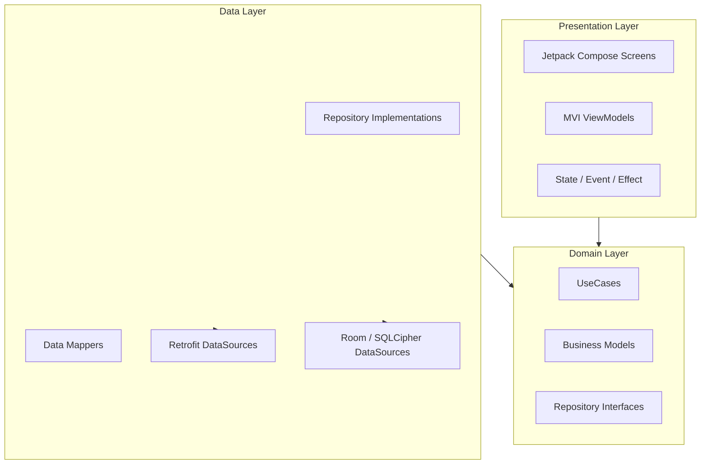

# Clean Architecture Audit Report - SDMS Android

**Date**: July 16, 2026
**Version**: 1.2.0
**Status**: COMPLETED
**Auditor**: AI System Auditor

---

## Executive Summary
The SDMS Android application demonstrates a **high-fidelity implementation of Clean Architecture** principles. It effectively separates technical concerns (Data) from business logic (Domain) and user interface (Presentation). The use of the MVI-lite pattern in the Presentation layer further enhances predictability. While the architecture is strong, minor "leaks" in the Domain layer and missed opportunities for role-based isolation in DI were identified.

**Overall Architectural Maturity Score: 93/100**

---

## 🏗️ Layered Architecture Diagram

---

## 📐 Dependency Review

### 1. Dependency Direction
- **Finding**: Strictly follows `Presentation -> Domain <- Data`. Domain layer has zero dependencies on Android frameworks or the Data layer.
- **Evidence**: `GetAccessHistoryUseCase.kt` only depends on `AccessRepository` (interface).
- **Status**: ✅ **Verified**

### 2. SOLID Principles
- **S (Single Responsibility)**: UseCases are granular (e.g., `LoginUseCase`, `LogoutUseCase`).
- **O (Open/Closed)**: Repositories are easily extendable by adding new methods to interfaces.
- **L (Liskov Substitution)**: `AuthRepositoryImpl` correctly implements `AuthRepository`.
- **I (Interface Segregation)**: Interfaces are feature-scoped (e.g., `AccessRepository`, `FaceRepository`).
- **D (Dependency Inversion)**: ViewModels depend on UseCase interfaces/classes injected via Hilt.
- **Status**: ✅ **Verified**

### 3. Layer Isolation
- **Violation (P1)**: Domain models sometimes leak Data-layer concerns.
- **Evidence**: `GetAccessHistoryUseCase.kt` returns `Result<PageResponse<AccessLogDto>>`. The `AccessLogDto` is a data-layer DTO and should NOT be used in the Domain layer or UseCase signature.
- **Recommendation**: Map `AccessLogDto` to `AccessLog` (Domain Model) within the Repository implementation before returning it to the UseCase.

---

## 🧩 Feature & Role Isolation

### 1. Feature Slicing
- **Finding**: Code is organized by feature packages (`auth`, `access`, `payment`, `face`). This provides excellent scalability.
- **Status**: ✅ **Verified**

### 2. Role Isolation
- **Finding**: Implements **Navigation Role Guards** to separate `Student` and `Admin` flows.
- **Improvement Needed**: The DI layer (`feature` modules in Hilt) is mixed.
- **Evidence**: `AdminModule.kt` and `AuthModule.kt` are all installed in `SingletonComponent`.
- **Recommendation**: Consider using feature-scoped components or custom qualifiers to prevent Admin dependencies from being accessible to Student-scoped ViewModels.

---

## 🔍 Detailed Findings

### 1. DTO Leakage in UseCases (Violation of Layer Isolation)
- **Problem**: Several UseCases in the `access` and `admin` modules return DTOs instead of Domain Models.
- **Evidence**: `GetAccessHistoryUseCase#invoke` returns `PageResponse<AccessLogDto>`.
- **Severity**: **Medium**.
- **Impact**: Changes in the backend API schema (DTO) force changes in the Domain and Presentation layers, breaking the primary purpose of Clean Architecture.

### 2. High UseCase Granularity
- **Strength**: Every action is encapsulated in a single class (e.g., `CheckSessionUseCase`).
- **Evidence**: `shared/auth/domain/usecase/` contains 10+ focused classes.
- **Impact**: High testability and clear business intent.

### 3. Navigation Integrity
- **Finding**: Uses a centralized `AppNavigation` with nested graphs for different roles.
- **Evidence**: `RoleGuard.kt` provides a high-level UI component to intercept unauthorized access.
- **Status**: ✅ **Verified**

---

## Recommendations
1. **Sanitize UseCase Signatures**: (URGENT) Update all UseCases to return only Domain Models (e.g., `AccessLog` instead of `AccessLogDto`).
2. **Standardize Result Wrapping**: Ensure all Repository methods return `Result<T>` or a dedicated `Resource<T>` to handle errors uniformly in the Domain layer.
3. **Refine DI Scoping**: Explore `ActivityRetainedComponent` or custom Hilt entry points for Admin-only features to strictly enforce Role Isolation at the binary level.

## Conclusion
The SDMS Android architecture is a textbook example of modern Android development. It is robust, testable, and maintainable. Resolving the DTO leakage in the Domain layer is the final step to achieving architectural purity.

---
*Audited by AI Agent - Step 6 Complete*
