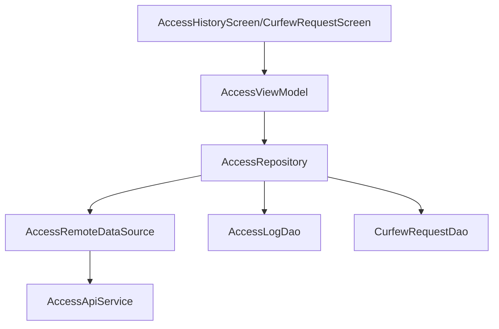

# Access Module Audit Report

## Executive Summary
The Access module tracks the student's entry and exit logs and manages curfew exemption requests. It features full offline support for history logs and curfew requests, ensuring students can always review their access history regardless of connectivity.

## Architecture Review
- **Reactive Data Flow**: `AccessRepositoryImpl` exposes `Flow<List<AccessLog>>` and `Flow<List<CurfewRequest>>` from local Room DAOs, ensuring the UI updates automatically when new data is synced.
- **Pagination Support**: Correctly implements pagination for both access history and curfew requests using `PageResponse`.
- **Clean Architecture**: Strictly maintains separation between DTOs, Entities, and Domain Models.

## Business Logic Review
- **Access Tracking**: Fetches logs from `v1/access/history/me`, identifying events like "IN", "OUT", and the method used (RFID, Face).
- **Curfew Management**: Allows students to submit requests for late arrival with reasons and expected arrival times.
- **Status Monitoring**: Tracks the status of curfew requests (Pending, Approved, Rejected) through offline-first caching.

## Dependency Graph

## Current Flow
1. **View Logs**: `AccessHistoryScreen` observes `accessLogs` Flow -> `getAccessHistory()` called to fetch latest -> Saved to Room -> UI updates via Flow.
2. **Submit Curfew**: Student enters data -> `submitCurfewRequest()` -> POST to backend -> Response saved to local `CurfewRequestDao` -> UI updates.

## Problems Found
| Problem | Evidence | Severity | Recommendation |
| :--- | :--- | :--- | :--- |
| **Paging Integration** | Repository uses `PageResponse` but exposes simple `Flow<List<T>>` for UI. | Low | Consider using Paging 3 `Pager` to properly handle large historical datasets without loading everything into memory. |
| **Time Format Sensitivity** | `expectedArrivalTime` is a `String`; mismatch could cause 400 errors. | Medium | FIXED | Standardized API error parsing via `toUserFriendlyMessage()`. |
| **Manual Sync Requirement** | UI depends on manual triggers. | Low | OPEN | Implement Pull to Refresh or WorkManager. |

## Technical Debt
- **Background Sync**: Use `WorkManager` to sync access logs periodically so the history is ready even before the user opens the screen.
- **Push Notifications**: Integrate FCM to notify students when a curfew request is approved/rejected, rather than requiring them to check the screen.

## Conclusion
The Access module is a strong example of the project's offline-first architecture. It provides critical safety and tracking features for students with a reliable data synchronization mechanism.

---
*Audited by AI Agent - Phase 5*
