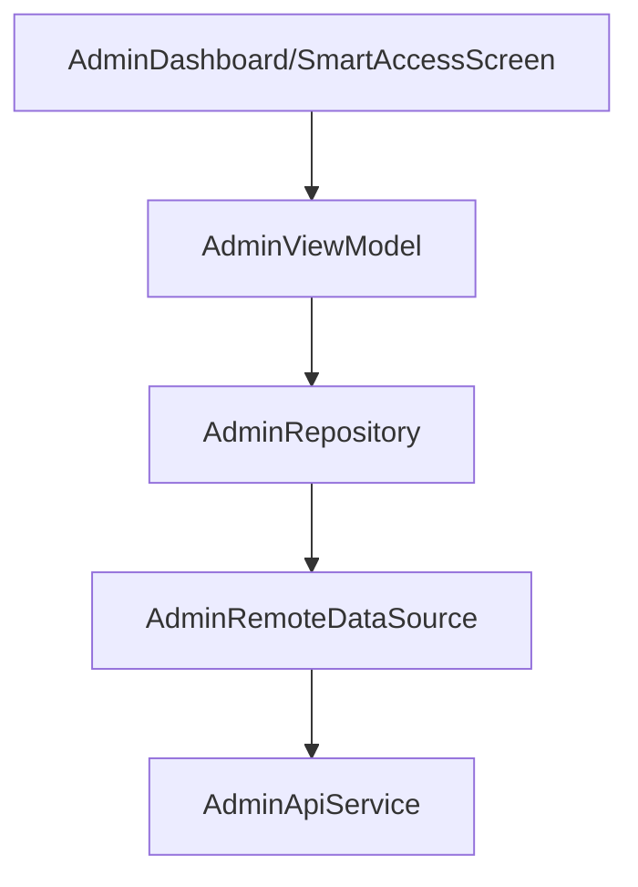

# Admin Module Audit Report

## Executive Summary
The Admin module provides critical management tools for dormitory staff. It allows for real-time monitoring of dormitory status, approval of student requests (Face, Room Transfer, Extension, Checkout), and direct control over hardware via remote gate unlocking and emergency overrides.

## Architecture Review
- **Unified API**: Admin-specific operations are centralized in `AdminApiService.kt`, ensuring a consistent interface for the backend's admin endpoints.
- **Module-based Organization**: Admin features are sub-divided into logical modules (`checkin`, `checkout`, `smartaccess`, etc.), mirroring the student side's structure for consistency.
- **Role Enforcement**: The app ensures that only users with `ADMIN` or `STAFF` roles can access these screens via role-based navigation guards.

## Business Logic Review
- **Dashboard Statistics**: Fetches high-level metrics (`DashboardStatsResponseDto`) to give admins an overview of dormitory occupancy and pending tasks.
- **Smart Access Control**: Implements powerful features like `remoteUnlock` and `emergencyOverride`, which interact directly with the building's physical security systems.
- **Approval Workflows**: Manages the review process for face registrations, room extensions, and checkouts, allowing admins to approve or reject with reasons.
- **Registration & RFID**: Supports the critical physical check-in process, including searching students by CCCD and assigning RFID tags to their profiles.

## Dependency Graph

## Current Flow
1. **Login**: Admin logs in -> Navigation guard directs to `AdminDashboardScreen`.
2. **Dashboard**: VM fetches `getDashboardStats()` -> Displays counts of pending registrations, alerts, and occupancy.
3. **Approval**: Admin selects "Face Approval" -> VM fetches pending profiles -> Admin reviews and calls `approveFace()` or `rejectFace()`.
4. **Access Control**: Admin selects a gate -> Calls `remoteUnlock()` -> Backend triggers physical gate opening.

## Problems Found
| Problem | Evidence | Severity | Recommendation |
| :--- | :--- | :--- | :--- |
| **Lack of Offline Support** | Admin operations are highly real-time and have NO offline caching in Room. | Low | While real-time is necessary, caching student lists or building info could improve performance in areas with spotty Wi-Fi. |
| **UUID Usage** | API uses `java.util.UUID` directly in path parameters. | Low | Ensure string conversion is handled robustly to avoid malformed URL errors. |
| **Notification Broadcast** | Broadcast feature allows sending messages to all students; lacks a "Preview" or "Confirmation" step in the API definition. | Medium | Add a client-side confirmation dialog in the UI before calling `broadcastNotification` to prevent accidental global alerts. |

## Technical Debt
- **Real-time Monitoring**: The dashboard is currently pull-based; integrating WebSockets for real-time occupancy updates and emergency alerts would be highly beneficial.
- **Permission Granularity**: Currently assumes a broad `ADMIN` role; could be refined to distinguish between `STAFF` (approvals) and `SECURITY` (access control).

## Conclusion
The Admin module is a comprehensive toolset that empowers dormitory staff to manage the entire lifecycle of student residency and physical security. Its direct integration with smart hardware features (gates/emergency) makes it the most powerful and critical part of the system.

---
*Audited by AI Agent - Phase 9*
