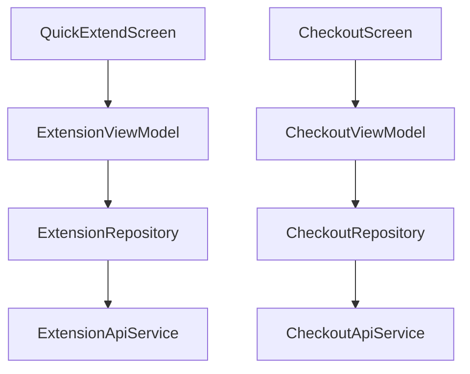

# Application & Requests Module Audit Report

## Executive Summary
This module covers various administrative requests a student can make, specifically focused on "Stay Extension" and "Checkout". It manages the lifecycle of a student's stay in the dormitory, from extending their contract to notifying the management of their departure.

## Architecture Review
- **Separation**: Requests are logically separated into `extension` and `checkout` packages, each following Clean Architecture.
- **Repository Abstraction**: Use cases interact with `ExtensionRepository` and `CheckoutRepository` to handle complex multi-step processes like eligibility checking before submission.
- **Data Models**: Use of specific response models (`StayExtensionResponse`, `CheckoutResponse`) to track the status of applications.

## Business Logic Review
- **Extension Eligibility**: Implements a `checkEligibility` flow (potentially using CCCD) before allowing a student to submit an extension request, adhering to backend constraints.
- **Period Validation**: Checks if the "Extension Period" is currently active (`isExtensionPeriodActive`) to enable/disable UI features.
- **Checkout Process**: Allows students to submit checkout requests and track the history of their departures.

## Dependency Graph

## Current Flow
1. **Extension**: Student opens Extend screen -> App checks `isExtensionPeriodActive()` -> Student checks eligibility -> Submits request.
2. **Checkout**: Student submits checkout reason and date -> POST to `submitCheckoutRequest()` -> Tracks status (Pending/Approved).

## Problems Found
| Problem | Evidence | Severity | Recommendation |
| :--- | :--- | :--- | :--- |
| **Eligibility Data Consistency** | `checkEligibility` uses CCCD as input, which should ideally be pulled from the cached Profile. | Low | Auto-populate CCCD from `UserProfileEntity` in the ViewModel to reduce manual entry errors. |
| **Error Message Clarity** | Failed eligibility checks should return specific reasons (e.g., "Debt unpaid", "Period closed"). | Medium | Ensure the UseCase maps specific backend error codes to user-friendly Vietnamse messages. |
| **Lack of Offline Visibility** | Application status is not cached locally. | Medium | Cache the latest application status in Room so students can see their "Approved" status even offline. |

## Technical Debt
- **Shared Logic**: Many "Application" type requests (Room Transfer, Extension, Checkout) share similar status-tracking UI; consider a common "Request Tracker" component.
- **Document Generation**: Backend supports PDF generation for applications; the mobile app could provide a link or viewer for these PDFs once approved.

## Conclusion
The Application module correctly implements the business logic for stay management. It effectively enforces period-based constraints and eligibility rules, ensuring a smooth administrative flow between the student and the dormitory management.

---
*Audited by AI Agent - Phase 8*
