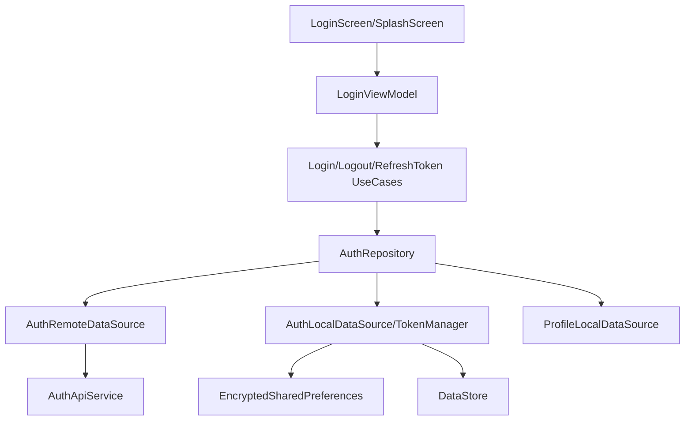

# Authentication Module Audit Report

## Executive Summary
The Authentication module implements a robust, security-first architecture following Clean Architecture and MVI-lite principles. It correctly integrates JWT-based authentication with Access and Refresh tokens, secured local storage using `EncryptedSharedPreferences`, and Biometric authentication.

## Architecture Review
- **Layering**: Strictly follows `Presentation -> Domain <- Data`.
- **MVI Implementation**: `LoginViewModel` uses `LoginContract` (State, Event, Effect) consistently.
- **DI**: Hilt is used for dependency injection, with logical separation in `NetworkModule`.
- **SSOT**: `TokenManager` serves as the single source of truth for auth state, utilizing both `EncryptedSharedPreferences` (for tokens) and `DataStore` (for state flags).

## Business Logic Review
- **Role Handling**: Implements RBAC with `STUDENT` and `ADMIN`/`STAFF` roles. Roles are extracted from JWT payloads and synchronized with profile data.
- **Session Management**: `TokenAuthenticator` handles 401 errors by attempting a token refresh, preventing unnecessary logouts.
- **Biometric Flow**: Integrated into the `SplashScreen`, allowing quick access if previously enabled.

## Dependency Graph

## Current Flow
1. **Splash**: Checks for session + biometric.
2. **Login**: User enters credentials -> `AuthRepository.login()` -> `AuthApiService.login()`.
3. **Storage**: Access/Refresh tokens stored in `EncryptedSharedPreferences`. Role stored locally.
4. **Interception**: `AuthInterceptor` adds Bearer token to all non-public requests.
5. **Auto-Refresh**: `TokenAuthenticator` triggers on 401, calls refresh endpoint, and retries original request.

## Problems Found
| Problem | Evidence | Severity | Recommendation |
| :--- | :--- | :--- | :--- |
| **Potential Role Desync** | `AuthRepositoryImpl` falls back to "STUDENT" if JWT decode fails, even for Admins. | Medium | Ensure login response always includes a verified role field or fail login if JWT is unparseable. |
| **Token Handling in Logout** | `AuthRepositoryImpl.logout()` ignores API failure but clears local tokens. | Low | Good for UX, but should log remote failure for server-side session cleanup tracking. |
| **Certificate Pinning** | `NetworkModule` uses placeholder pins for development. | Medium | Update with production pins before release to prevent MITM. |

## Technical Debt
- **Error Handling**: `toUserFriendlyMessage()` is used but specific error codes from backend (e.g., `REFRESH_TOKEN_EXPIRED`) could be handled more granularly in the UI.
- **Biometric Fallback**: If biometric fails, it defaults to login. A "Try again" option in UI could be more user-friendly than immediate redirect.

## Conclusion
The Authentication module is highly compliant with `PROJECT_RULE.md` and `SECURITY_GUIDE.md`. The implementation of encrypted storage and automated token refresh provides a high level of security and a seamless user experience.

---
*Audited by AI Agent - Phase 1*
