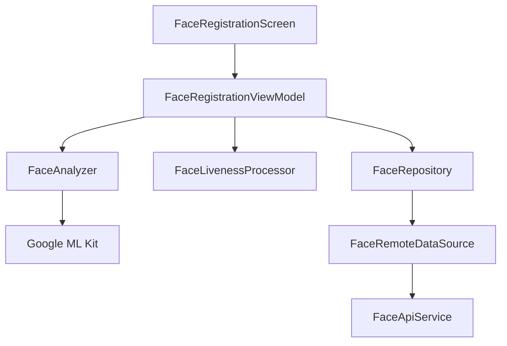

# Face Recognition Module Audit Report

## Executive Summary
The Face Recognition module is a high-complexity component that manages the registration and verification of student biometric data. It features a custom AI processing pipeline for liveness detection (blink, turn, smile) using ML Kit and integrates directly with CameraX for real-time analysis.

## Architecture Review
- **AI Processing Layer**: Modularized in `com.ktx.dormitory.ai`, separating low-level analysis (`FaceAnalyzer`) from business-level liveness logic (`FaceLivenessProcessor`).
- **Standard Layering**: `FaceRepositoryImpl` handles multipart file uploads for biometric images, adhering to standard data patterns.
- **Resource Management**: Uses CameraX and lifecycle-aware components to manage camera resources efficiently.

## Business Logic Review
- **Liveness Pipeline**: Implements a multi-step verification process (Blink -> Turn Left -> Turn Right -> Smile) to prevent spoofing (e.g., using photos/videos).
- **Registration Flow**: Securely uploads face images as multipart files to `v1/face/register`.
- **History Tracking**: Allows students to view their verification history, including failed attempts, which is critical for security auditing.

## Dependency Graph

## Current Flow
1. **Init**: `FaceRegistrationScreen` opens CameraX -> `FaceAnalyzer` receives frames.
2. **Analysis**: ML Kit detects face and landmarks -> `FaceLivenessProcessor` validates steps (Blink, Turn, etc.).
3. **Capture**: Once liveness is confirmed, the best quality frame is captured as a file.
4. **Upload**: File is sent to backend via `registerFaceMultipart()`.
5. **Approval**: Backend processes the image and registers the embedding (not done on mobile).

## Problems Found
| Problem | Evidence | Severity | Recommendation |
| :--- | :--- | :--- | :--- |
| **Local File Exposure** | Temporary captured image files might remain on disk after upload. | Medium | Ensure temporary files are deleted immediately after the upload completes or if the session is cancelled. |
| **Wait-time between steps** | `FaceLivenessProcessor` moves steps immediately, which might be too fast for some users. | Low | Add a short delay (e.g., 500ms) between liveness steps for a better UX. |
| **Error Handling (ML Kit)** | If ML Kit fails to initialize (e.g., missing dependencies), the app may crash. | Medium | Wrap ML Kit initialization in try-catch and provide a fallback or clear error message to the user. |

## Technical Debt
- **Edge Processing**: While the backend does embedding, a local lightweight embedding check (e.g., via TFLite) could provide instant feedback on whether the face is "recognizably" the same as the registered one.
- **Hardware Variation**: Camera performance and ML Kit latency vary wildly across devices; consider a "low-performance mode" for older hardware.

## Conclusion
The Face Recognition module is a sophisticated implementation that successfully combines mobile ML capabilities with secure backend synchronization. The liveness detection logic is well-structured and provides a high level of assurance for biometric registration.

---
*Audited by AI Agent - Phase 6*
