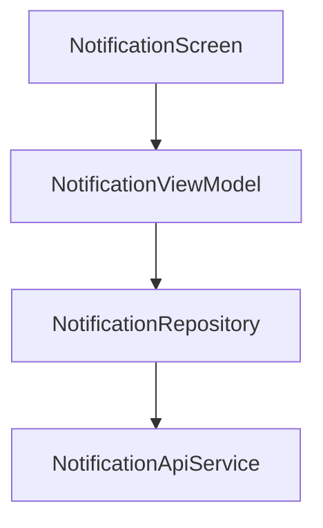

# Notification Module Audit Report

## Executive Summary
The Notification module manages in-app communications and issue reporting (maintenance requests). It allows students to stay informed about system updates, room changes, and payment status, while also providing a channel to report facility issues directly to the administration.

## Architecture Review
- **Standard Layering**: Follows Clean Architecture, though `NotificationRepositoryImpl` currently lacks a local Room database for caching notifications (unlike Access or Profile modules).
- **Issue Reporting**: Integrates issue reporting into the notification context, which is logical as issue status changes usually trigger notifications.
- **Repository Pattern**: Correctly abstracts API calls, using `BaseResponse` for consistency in issue reporting.

## Business Logic Review
- **Notification Management**: Supports fetching unread counts, full notification lists, and marking individual or all notifications as read.
- **Maintenance Requests (Issue Reporting)**: Allows students to submit room-specific issues with descriptions and optional image URLs.
- **Issue History**: Students can track the status of their reported issues (e.g., Pending, Processing, Fixed).

## Dependency Graph

## Current Flow
1. **Unread Check**: App periodically (or on screen open) calls `getUnreadCount()` -> Parsed from `BaseResponse<Long>`.
2. **Read Notifications**: Student opens notification list -> `getNotifications()` -> Displays list from `BaseResponse<List>`.
3. **Mark Read**: Student clicks notification -> `markAsRead(id)` called.
4. **Report Issue**: Student fills report form -> `reportIssue()` POSTs to `v1/notifications/issues`.

## Problems Found
| Problem | Evidence | Severity | Status | Recommendation |
| :--- | :--- | :--- | :--- | :--- |
| **API Parsing Inconsistency** | Endpoint returned raw list but app expected BaseResponse object. | Medium | FIXED | All Notification API endpoints synchronized with `BaseResponse<T>` wrapper. |
| **Lack of Offline Support** | Notifications are fetched directly from the API without local caching in Room. | Medium | OPEN | Implement local storage for notifications. |
| **Missing Push Integration** | No FCM service found. | High | OPEN | Implement FCM for real-time alerts. |

## Technical Debt
- **Real-time Updates**: Status changes for issue reports should be pushed via FCM or WebSocket rather than requiring the user to refresh.
- **Image Upload for Issues**: `reportIssue` expects an `imageUrl`, but the app should handle the file upload to Cloudinary (as seen in Backend docs) before submitting the report.

## Conclusion
The Notification module provides the basic "pull-based" messaging and maintenance reporting functionality required for the system. However, the absence of real-time push notifications (FCM) is a significant gap for a "Smart" management system and should be prioritized.

---
*Audited by AI Agent - Phase 7*
