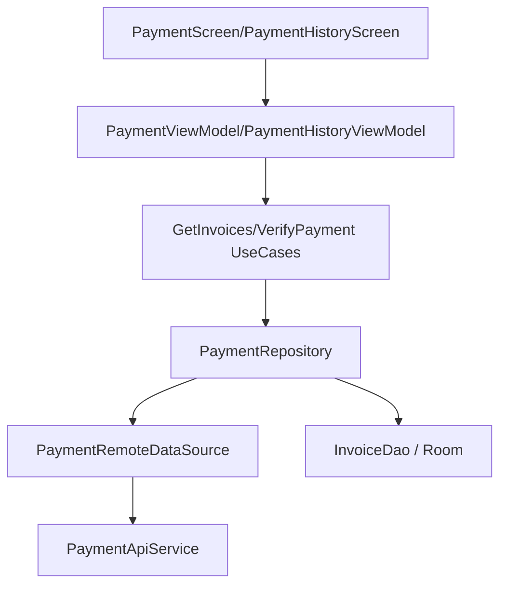

# Payment Module Audit Report

## Executive Summary
The Payment module manages student financial obligations, including room fees and utility bills. It supports offline viewing of invoices via `InvoiceDao` and provides a mechanism for verifying manual or online payments.

## Architecture Review
- **Storage**: Correctly implements offline caching for invoices using Room (`InvoiceDao`), adhering to the "Offline First" architectural principle.
- **Repository Pattern**: `PaymentRepositoryImpl` encapsulates the logic for merging local and remote data.
- **API Mapping**: Uses a mix of specific DTOs (`InvoiceDto`, `TransactionDto`) and generic maps for payment verification.

## Business Logic Review
- **Invoice Tracking**: Fetches all bills associated with the student (`v1/bills/me`).
- **Payment Verification**: Allows students to submit proof of payment (transaction code, method) for backend verification.
- **Payment Instructions**: Fetches banking or payment instructions from a public endpoint (`v1/public/payment-instructions`), ensuring students can always access payment details even when logged out (theoretically, though here used within the student flow).

## Dependency Graph

## Current Flow
1. **View Bills**: `PaymentScreen` loads -> Repository fetches from API -> Saves to Room -> Displays list.
2. **Offline**: If network is down, Repository returns data from `InvoiceDao`.
3. **Verify**: Student pays via external app (Banking/Momo) -> Returns to SDMS -> Enters transaction code -> `verifyPayment()` POSTs data to backend.

## Problems Found
| Problem | Evidence | Severity | Status | Recommendation |
| :--- | :--- | :--- | :--- | :--- |
| **Instruction Data Model** | `getPaymentInstructions` returned direct DTO. | Low | FIXED | Standardized API error parsing via `toUserFriendlyMessage()`. |
| **Verification Payload** | `verifyPayment` uses `HashMap`. | Medium | OPEN | Define a `VerifyPaymentRequest` DTO. |
| **API Endpoint Duplication** | Redundant calls to `v1/bills/me`. | Low | OPEN | Verify and filter accordingly. |

## Technical Debt
- **Pagination**: Large payment histories should be paginated using Paging 3.
- **Sync Status**: After payment verification, the invoice list should be refreshed to show the "Pending" or "Paid" status immediately.

## Conclusion
The Payment module is well-integrated with the local database, providing a reliable user experience for tracking fees. Improving the type-safety of payment verification and standardizing API responses would further enhance its maintainability.

---
*Audited by AI Agent - Phase 4*
