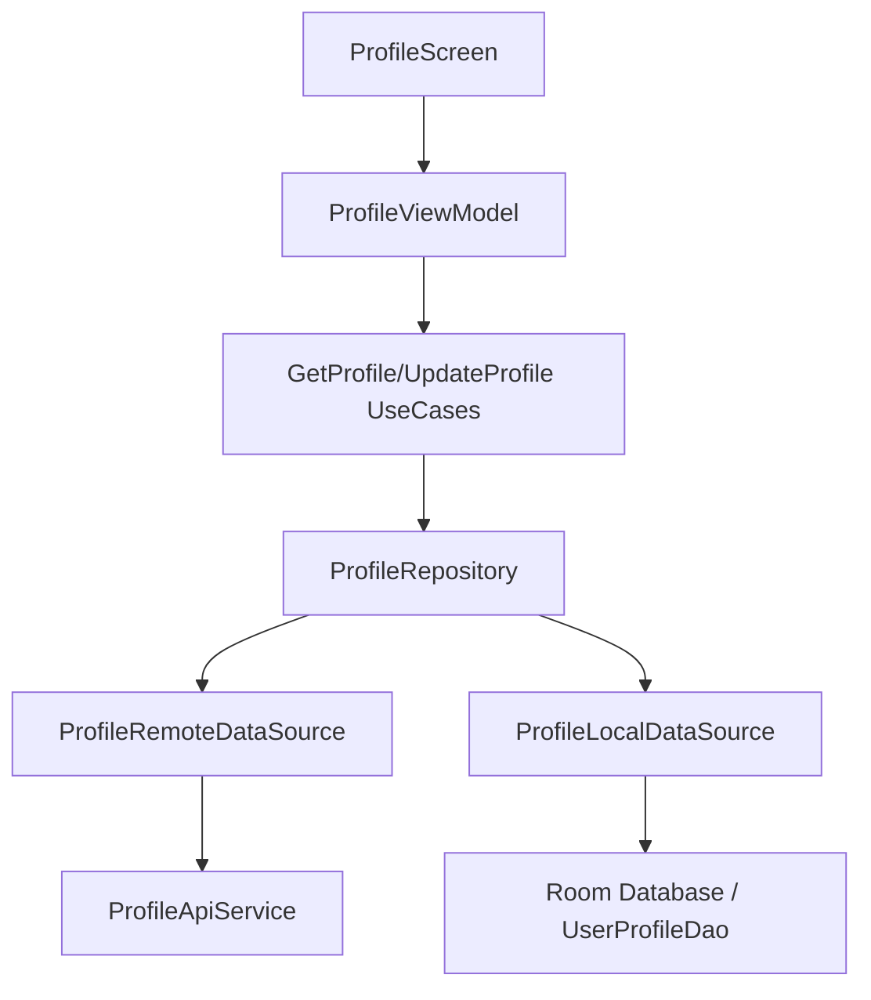

# Profile Module Audit Report

## Executive Summary
The Profile module provides comprehensive management of student personal data, supporting both online retrieval and offline caching. It adheres to Clean Architecture and features robust integration with the `data/local` Room database for offline-first capabilities.

## Architecture Review
- **Clean Architecture**: Well-defined layers. The `ProfileRepositoryImpl` orchestrates data flow between `ProfileRemoteDataSource` and `ProfileLocalDataSource`.
- **Offline First**: Implements a strong offline strategy where cached data is returned if the network fails, fulfilling architectural requirement **3. Single Source of Truth**.
- **MVI Consistency**: Uses `ProfileContract` and `ProfileViewModel` in alignment with the project's MVI-lite pattern.

## Business Logic Review
- **Data Integrity**: The `UserProfileEntity` captures all critical student information including emergency contacts and parent info, mirroring the backend data model.
- **Avatar Management**: Supports multipart file uploads for avatars.
- **Role Awareness**: Integrates with `AuthRepository` (as seen in `AuthRepositoryImpl`) to fetch the correct profile based on whether the user is a `STUDENT` or `ADMIN`.

## Dependency Graph

## Current Flow
1. **Load**: `ProfileViewModel` triggers `LoadProfile` event.
2. **Fetch**: `ProfileRepository` calls `getDetailedProfile()` (Remote).
3. **Sync**: On success, data is saved to `UserProfileEntity` in Room.
4. **Fallback**: If network is unavailable, the repository fetches the `firstOrNull()` entry from Room.
5. **Update**: `UpdateProfile` event sends a PATCH request to `v1/students/me`.
6. **Logout**: `Logout` event triggers `LogoutUseCase`, clearing local session and redirecting to Login.

## Problems Found
| Problem | Evidence | Severity | Status | Recommendation |
| :--- | :--- | :--- | :--- | :--- |
| **Missing Logout Button** | No clear UI element for session termination in Profile. | Medium | FIXED | Added Red Logout icon in TopAppBar. |
| **State Persistence Crash** | `ProfileUiState` was not Parcelable. | High | FIXED | Implemented `@Parcelize`. |
| **Emergency Contact Validation** | Validation for `emergencyContact` phone numbers appears minimal. | Medium | OPEN | Add regex validation. |
| **Profile Overwrite** | Saves profile to Room regardless of existing data. | Low | OPEN | Implement sync logic. |

## Technical Debt
- **Pagination**: Profile-related lists (if any future ones are added, e.g., siblings) should use Paging 3.
- **Encryption**: While the DB is secured via SQLCipher, sensitive fields like `cccd` could be further encrypted at the field level if extra security is desired.

## Conclusion
The Profile module is robust and correctly implements the offline-first principle. It effectively bridges the gap between authentication and user-specific data, ensuring student information is always available even without a connection.

---
*Audited by AI Agent - Phase 2*
