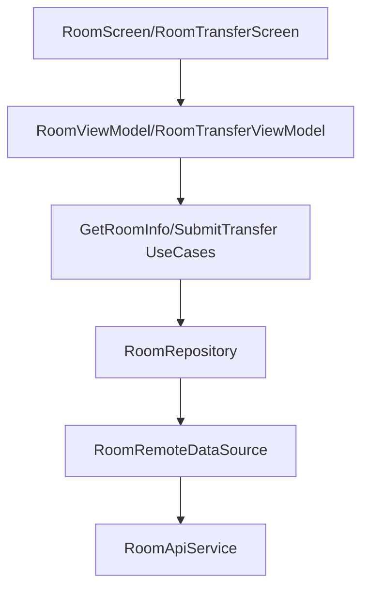

# Room Module Audit Report

## Executive Summary
The Room module manages the student's current living quarters and their requests for room transfers. It provides a clear interface for viewing room details, including capacity and current occupancy, and handles the submission and tracking of room change requests.

## Architecture Review
- **Structure**: Follows the project's standard Clean Architecture pattern.
- **Repository Pattern**: `RoomRepositoryImpl` effectively abstracts API calls, though it currently lacks a local caching layer (unlike the Profile module).
- **MVI Implementation**: Utilizes `RoomContract` and `RoomTransferContract` for predictable state management in the UI.

## Business Logic Review
- **Room Information**: Fetches detailed information about the student's current room, including room number, building, and utilities.
- **Transfer Requests**: Implements the logic for requesting a room change, allowing students to provide a reason and optionally specify a target room.
- **History Tracking**: Provides access to a history of previous room transfer requests and their current status (Pending, Approved, Rejected).

## Dependency Graph

## Current Flow
1. **View Room**: Student opens the Room screen -> `GetRoomInfoUseCase` -> Fetches from `v1/student/room/current`.
2. **Transfer Request**: Student fills out transfer form -> `SubmitTransferRequestUseCase` -> POST to `v1/student/change-room`.
3. **History**: Student views history -> `GetTransferHistoryUseCase` -> Fetches from `v1/student/change-room` (GET).

## Problems Found
| Problem | Evidence | Severity | Recommendation |
| :--- | :--- | :--- | :--- |
| **Lack of Offline Support** | No local storage found for Room information in `data/local`. | Medium | Implement Room caching to allow students to view their room info without an active internet connection, consistent with the "Offline First" principle. |
| **Input Validation** | `RoomTransferRequest` reason length validation is not explicitly visible in the Repository. | Low | Ensure the ViewModel or UseCase validates the reason length before submission to prevent API errors. |
| **Sync with Profile** | Room changes may not immediately reflect in the cached Profile if not manually triggered. | Low | Trigger a Profile refresh or update the cached `UserProfileEntity` after a room transfer is approved. |

## Technical Debt
- **Paging**: Room transfer history should ideally use Paging if the history becomes large.
- **Real-time Updates**: Status changes for transfer requests are currently pull-based; consider WebSocket or FCM for real-time notifications of approval/rejection.

## Conclusion
The Room module is well-structured but would benefit significantly from implementing the offline caching strategy seen in the Profile module. The core functionality for room management and transfers is present and correctly mapped to the backend API.

---
*Audited by AI Agent - Phase 3*
