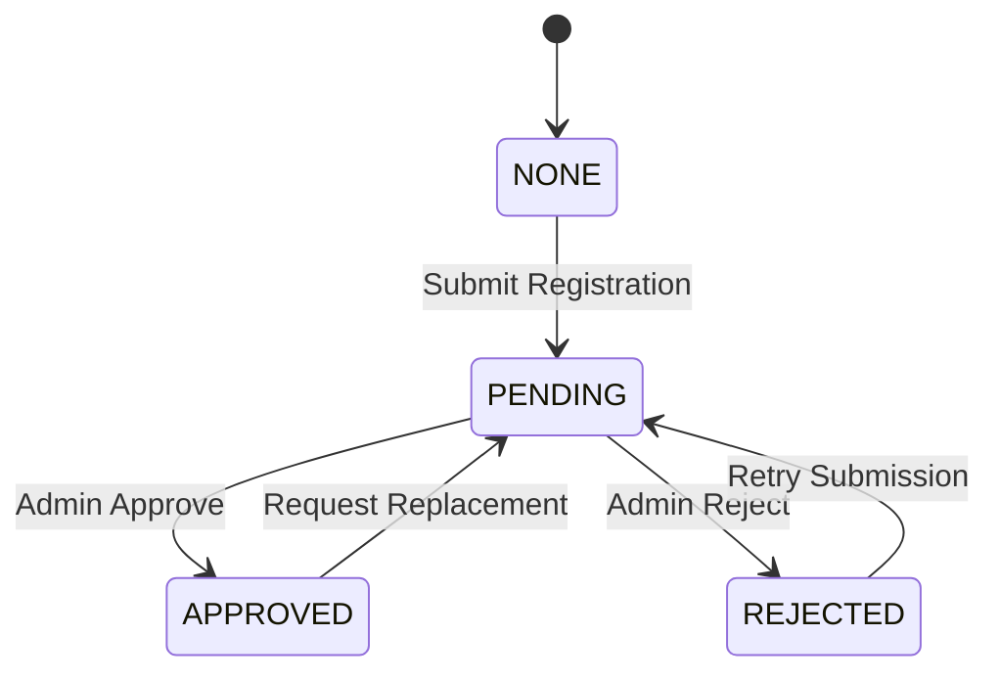

# UI State Machines & Entity Status Mapping

This document describes how the status of backend entities (e.g., FaceProfile, Bill, CheckoutRequest) translates into visual UI states and transitions in the Android application.

## 1. Face Profile Status (BR-I01)
Mapped from `FaceProfileStatus` enum.

| Status | UI Visual State | Action Guard |
| :--- | :--- | :--- |
| **NONE (404)** | Welcome / "Start Registration" | Enable "Bắt đầu đăng ký" |
| **PENDING** | "Pending Approval" (Yellow) | Disable registration; Show info |
| **APPROVED** | "Active" (Green) | Show current face; Enable "Update" |
| **REJECTED** | "Error" (Red) | Show reason; Enable "Retry" |

## 2. Bill / Payment Status (BR-R02)
Mapped from `BillStatus` / `PaymentStatus`.

| Status | UI Visual State | Impact on Flows |
| :--- | :--- | :--- |
| **UNPAID** | Alert / "Pay Now" | Blocks Checkout flow |
| **OVERDUE** | Critical Alert (Red) | Blocks Checkout; High Priority in List |
| **PAID** | Success (Green) | Allows Checkout flow |
| **CANCELLED**| Strikethrough / Inactive | Ignored in debt checking |

## 3. Checkout Request Status
Transitions for the Early Checkout flow.

| Status | UI Color | User Interaction |
| :--- | :--- | :--- |
| **PENDING** | Amber | Can view details; Cannot submit new request |
| **APPROVED** | Green | Show checkout instructions / final date |
| **REJECTED** | Red | Show rejection reason; Can resubmit |
| **COMPLETED**| Gray | Request archived in history |

---

> [!TIP]
> Use standard Material 3 color tokens (`error`, `primary`, `tertiary`) to represent these statuses consistently across the application.
