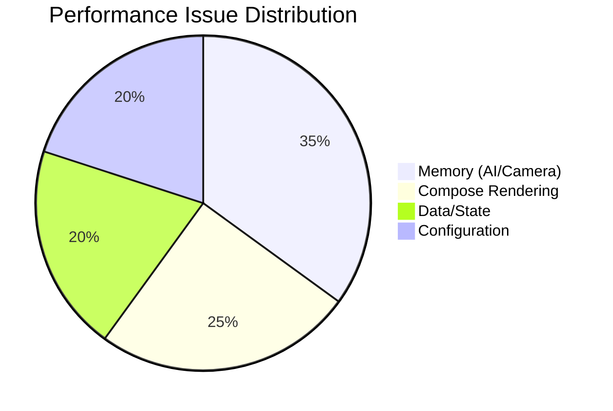

# Implementation Report - Performance Audit

**Task**: Complete Comprehensive Performance Audit
**Date**: 2026-07-11
**Status**: COMPLETED

## Work Performed
1.  **Compose Audit**: Analyzed recomposition patterns, state observation (`collectAsStateWithLifecycle`), and list optimizations in `AccessHistoryScreen` and `NotificationScreen`.
2.  **AI Module Analysis**: Deep-dived into `FaceAnalyzer` and `FaceRegistrationViewModel`. Identified high-frequency `Bitmap` allocations and inefficient `SavedStateHandle` updates.
3.  **Data/Network Review**: Evaluated `BaseRepository`, `HomeViewModel`, and Room DAOs. Identified sequential state updates and missing DB indices.
4.  **Configuration Check**: Reviewed `build.gradle.kts` for R8/ProGuard and dependency performance.
5.  **Documentation**: Generated a detailed performance audit report at [docs/audit/07_PERFORMANCE_AUDIT.md](../audit/07_PERFORMANCE_AUDIT.md).

## Key Findings
- **Critical Issues**: High memory churn in `FaceAnalyzer`, missing `key` in `LazyColumn` items, and R8 minification being disabled in production builds.
- **Improvements Needed**: Move heavy data transformations to ViewModels, batch UI state updates, and use `derivedStateOf`.

## Documentation Updated
-   [docs/audit/07_PERFORMANCE_AUDIT.md](../audit/07_PERFORMANCE_AUDIT.md)

