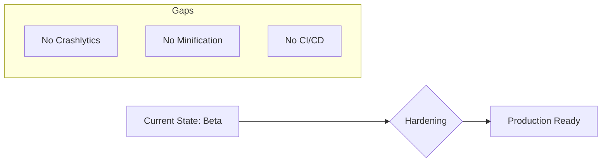

# Implementation Report - Production Readiness Audit

**Task**: Complete Comprehensive Production Readiness Audit
**Date**: 2026-07-11
**Status**: COMPLETED

## Work Performed
1.  **Build Audit**: Reviewed `build.gradle.kts` and `proguard-rules.pro`. Identified critical risk: `isMinifyEnabled = false`.
2.  **Infrastructure Audit**: Searched for CI/CD files and monitoring integrations (Firebase, Sentry). Found zero automated release or crash reporting tools.
3.  **Observability Review**: Evaluated logging strategy and application initialization. Confirmed direct usage of `Log.d` and absence of error reporting.
4.  **Sync & Offline Review**: Analyzed `SyncWorker.kt` for reliability. Identified missing features and lack of user feedback on failure.
5.  **Documentation**: Generated a detailed production readiness audit report at [docs/audit/09_PRODUCTION_READINESS.md](../audit/09_PRODUCTION_READINESS.md).

## Key Findings
- **Maturity**: The app is in a "High-Quality Beta" state but lacks the safety nets (Crashlytics, R8, CI/CD) required for a stable production release.
- **Top Risks**: Decompilation due to lack of minification, and "flying blind" in production due to lack of crash reporting.

## Documentation Updated
-   [docs/audit/09_PRODUCTION_READINESS.md](../audit/09_PRODUCTION_READINESS.md)

