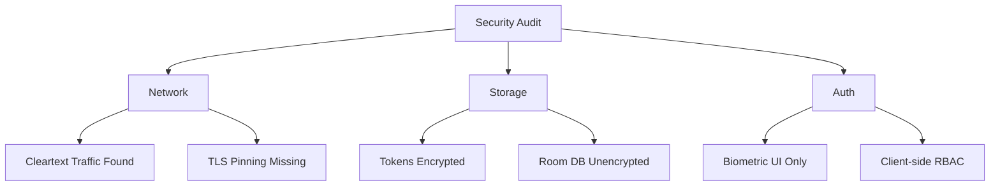

# Implementation Report - Security Audit

**Task**: Complete Comprehensive Security Audit
**Date**: 2026-07-11
**Status**: COMPLETED

## Work Performed
1.  **Network Audit**: Analyzed `AuthInterceptor`, `TokenAuthenticator`, and `NetworkModule`. Identified critical risk of cleartext traffic being permitted.
2.  **Auth & Biometric Review**: Evaluated JWT refresh logic and biometric integration. Found that biometric authentication is not cryptographically bound to token access.
3.  **Storage Audit**: Verified `EncryptedSharedPreferences` for tokens but identified unencrypted Room database containing PII.
4.  **Static Analysis**: Reviewed `AndroidManifest.xml` and ProGuard rules. Found lack of hardening and anti-tampering measures.
5.  **Documentation**: Generated a detailed security audit report at [docs/audit/05_SECURITY_AUDIT.md](../audit/05_SECURITY_AUDIT.md).

## Documentation Updated
-   [docs/audit/05_SECURITY_AUDIT.md](../audit/05_SECURITY_AUDIT.md)

## Conclusion
The application has implemented basic secure storage for tokens but has significant gaps in network security and device-level hardening. Immediate action is recommended to disable cleartext traffic and implement TLS pinning.

