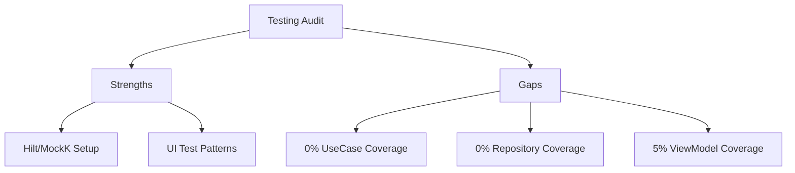

# Implementation Report - Testing Audit

**Task**: Complete Comprehensive Review of Testing Quality
**Date**: 2026-07-11
**Status**: COMPLETED

## Work Performed
1.  **Test Inventory**: Cataloged all tests in `src/test` and `src/androidTest`.
2.  **Structural Analysis**: Reviewed `SmartAccessViewModelTest` and `LoginScreenTest` to understand existing patterns (MockK, Compose Test Rule).
3.  **Coverage Gap Identification**: Compared the list of all UseCases, Repositories, and ViewModels against existing tests. Found 0% coverage for Domain/Data layers.
4.  **Infrastructure Audit**: Verified Hilt instrumentation setup and unit test dependencies (Truth, MockK, Turbine).
5.  **Documentation**: Generated a detailed testing audit report at [docs/audit/08_TESTING_AUDIT.md](../audit/08_TESTING_AUDIT.md).

## Key Findings
- **Strengths**: Solid testing framework setup (Hilt, MockK, Truth), decent quality for the few existing UI tests.
- **Critical Gaps**: Total lack of testing for 33+ UseCases and 11 Repositories. Extremely low ViewModel test coverage (5%).

## Documentation Updated
-   [docs/audit/08_TESTING_AUDIT.md](../audit/08_TESTING_AUDIT.md)

