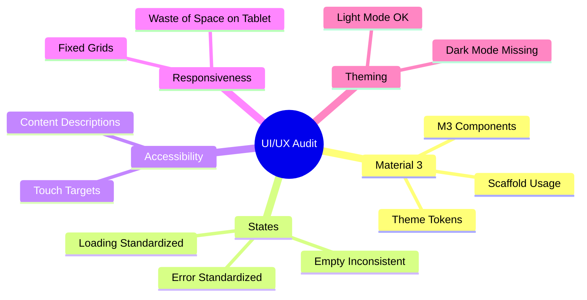

# Implementation Report - UI/UX Audit

**Task**: Complete Comprehensive UI/UX Review of Compose UI
**Date**: 2026-07-11
**Status**: COMPLETED

## Work Performed
1.  **Foundation Audit**: Reviewed `Theme.kt`, `Color.kt`, and `Type.kt`. Identified lack of Dark Mode support.
2.  **Component Analysis**: Evaluated shared components in `presentation/components/`. Found inconsistencies in `contentDescription` usage.
3.  **Feature Review**: Deep-dived into 10+ screens (Home, Profile, Login, Payment, etc.). Analyzed layout structure, state handling, and Material 3 compliance.
4.  **UX Flow Audit**: Verified role-based navigation and notification integration in `BottomNavBar` and `TopAppBar`.
5.  **Documentation**: Generated a detailed UI/UX audit report at [docs/audit/06_UI_UX_AUDIT.md](../audit/06_UI_UX_AUDIT.md).

## Key Findings
- **Strengths**: Solid Material 3 foundation, clean component-based architecture, robust loading/error states in core features.
- **Weaknesses**: No Dark Mode, limited accessibility optimizations, non-adaptive layouts for large screens.

## Documentation Updated
-   [docs/audit/06_UI_UX_AUDIT.md](../audit/06_UI_UX_AUDIT.md)

