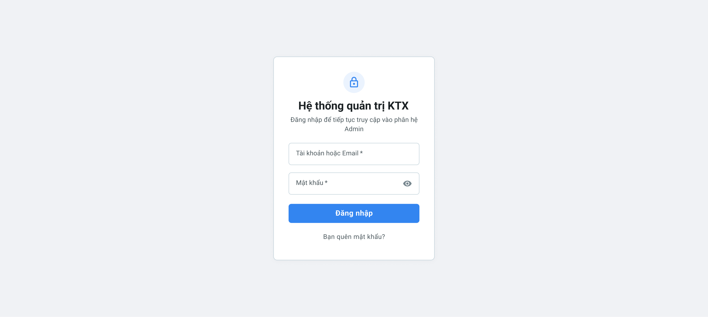
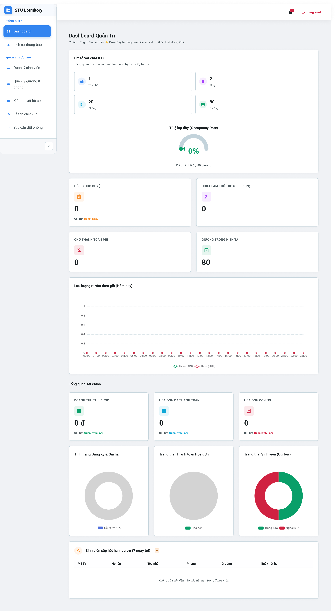
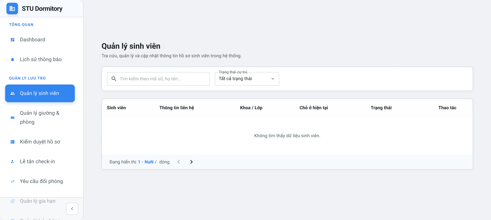
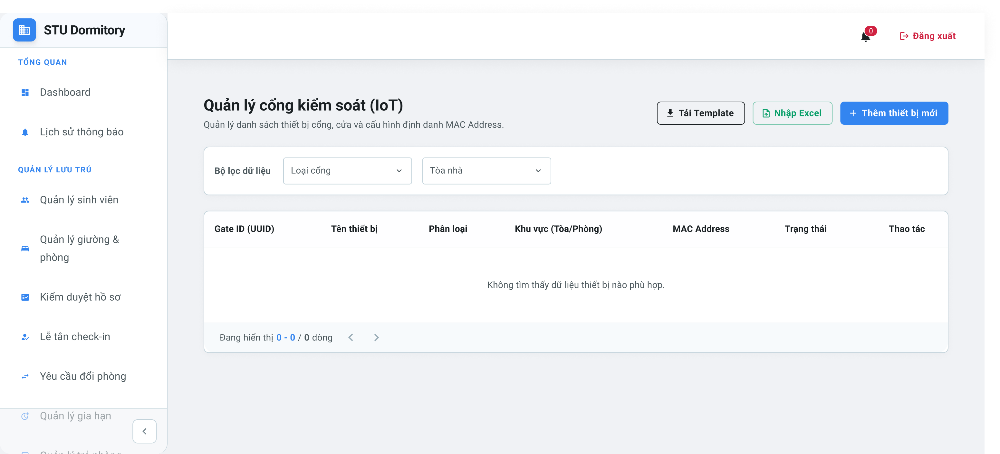

### 3.5.1. Phân hệ Quản trị hệ thống (Web Admin)

#### a. Giao diện Đăng nhập (Login)
Giao diện Đăng nhập là cửa ngõ truy cập dành cho Ban quản lý. Màn hình được thiết kế tối giản theo ngôn ngữ Material Design, tập trung vào tác vụ xác thực an toàn.

---

#### b. Giao diện Bảng điều khiển (Dashboard)
Trung tâm giám sát hoạt động toàn hệ thống, cung cấp cái nhìn tổng quan thông qua các chỉ số KPIs và biểu đồ trực quan thời gian thực.

---

#### c. Giao diện Quản lý sinh viên (Student Management)
Công cụ phục vụ tác vụ tra cứu, quản lý hồ sơ và cập nhật thông tin cư trú của sinh viên. Giao diện được tổ chức khoa học với các bộ lọc và bảng dữ liệu chi tiết.

---

#### d. Giao diện Quản lý cổng kiểm soát (IoT Management)
Thành phần cốt lõi trong việc vận hành hệ thống an ninh thông minh, cho phép giám sát và cấu hình các thiết bị cổng kiểm soát tích hợp công nghệ IoT.

---

### 3.5.2. Phân hệ Web dành cho Sinh viên (Web Public)

#### a. Trang chủ và Đăng ký lưu trú (Landing Page)
Giao diện tiếp cận chính dành cho sinh viên, cung cấp thông tin dịch vụ và là cổng khởi đầu cho quy trình đăng ký nội trú trực tuyến.

---

### 3.5.3. Ứng dụng di động dành cho Sinh viên (App Student)

#### a. Giao diện Trang chủ (Home Screen)
Cung cấp toàn bộ các tiện ích nội trú ngay trên thiết bị di động của sinh viên, cho phép theo dõi thông tin phòng ở và thông báo từ Ban quản lý.

---

#### b. Giao diện Định danh khuôn mặt (Face Recognition/AI)
Tích hợp trí tuệ nhân tạo để thay thế phương thức QR Code truyền thống. Sinh viên thực hiện đăng ký dữ liệu khuôn mặt để phục vụ việc ra vào cổng kiểm soát tự động.

---

#### c. Giao diện Thanh toán hóa đơn (Payment)
Hỗ trợ sinh viên thực hiện các nghĩa vụ tài chính (tiền phòng, điện, nước) một cách nhanh chóng thông qua cổng thanh toán QR động.

---

### 3.5.4. Ứng dụng di động dành cho Quản trị viên (App Admin)

#### a. Giao diện Bảng điều khiển di động (Mobile Dashboard)
Cung cấp khả năng giám sát linh hoạt cho cán bộ quản lý, cho phép theo dõi nhanh các thông số vận hành và thực hiện các nghiệp vụ khẩn cấp ngay trên thiết bị di động.

---
